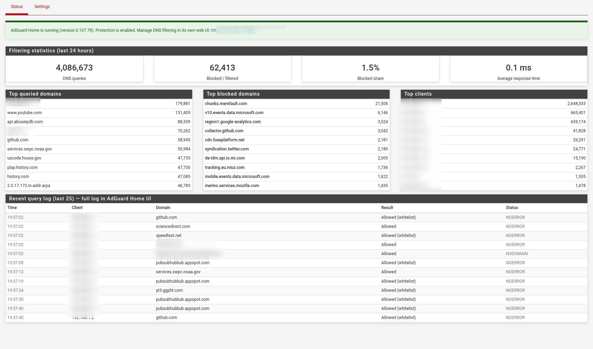

# pfSense-pkg-adguardhome

AdGuard Home manager package for pfSense: auto-install, service integration,
and a native Status/Settings UI under **Services → AdGuard Home**.

[]()
[]()
[]()



## Design: adopt-first

This package is a **management wrapper, not a config manager**:

- **Adopt mode** — AdGuard Home already present at `/opt/AdGuardHome`? The
  package installs around it: registers the pfSense service + menu, ensures
  boot persistence, and adds the UI. A running AdGuard Home is **never**
  stopped, restarted, or reconfigured; `AdGuardHome.yaml` is **never** written.
- **Fresh install** — no AdGuard Home found? The bundled, checksum-verified
  official release (`AdGuardHome_freebsd_amd64`) is extracted to
  `/opt/AdGuardHome` and started once; AdGuard Home's own first-run wizard
  (`http://<firewall>:3000`) finishes setup.
- All DNS and filtering configuration stays in **AdGuard Home's own web UI**,
  exactly as upstream intends. The package only *observes* (read-only API)
  and controls the service via rc.d.

## Features

- **Auto-install**: bundled AdGuard Home release tarball (sha256-verified
  against AdGuard's published checksums), extracted to `/opt/AdGuardHome` on
  fresh systems — no manual downloads.
- **Service integration**: official rc.d script, boot persistence via
  `AdGuardHome_enable=YES`, service visible and controllable under
  **Status → Services** (start/stop/restart) and the dashboard.
- **Status page** (Services → AdGuard Home → Status):
  - service state + running AdGuard Home version + latest upstream release
    (update notice when a newer version exists),
  - 24h filtering stats: queries, blocked count and share, average response
    time, protection on/off,
  - top queried domains, top blocked domains, top clients,
  - recent query-log tail with blocked entries highlighted,
  - 60s auto-refresh.
- **Dashboard widget**: an "AdGuard Home" tile for the pfSense dashboard
  (Status → Dashboard → add widget) — service state, version, 24h
  queries/blocked/avg response, protection state, update notice, and links
  to the status page and the AdGuard Home UI.
- **Status monitor with pfSense notifications**: a small supervised service
  (`pfsense_adguardhome_monitor`, checked every 5 minutes) that alerts via
  the pfSense notification channels (System → Advanced → Notifications,
  e.g. email/Telegram) when the AdGuard Home service is not running or
  protection is disabled — with hourly reminders and a recovery notice when
  the problem clears. Toggle it off in the package Settings page.
- **Settings page**: AdGuard Home API URL + read-only API credentials
  (masked, stored in config.xml) and query-log line count.
- **Theme-safe UI**: works in light, dark, and `prefers-color-scheme`
  hybrid themes (no hardcoded colors).

## Quick start

The pfSense GUI "Available Packages" list is pinned to the official Netgate
repo, so third-party packages install via the CLI:

1. Add the package repo (SSH or console on the pfSense box):

   ```sh
   mkdir -p /usr/local/etc/pkg/repos
   cat > /usr/local/etc/pkg/repos/pfsense-adguardhome.conf <<'EOF'
   pfsense-adguardhome: {
       url: "https://tmiland.github.io/pfsense-adguardhome/repo",
       mirror_type: "none",
       signature_type: "none",
       enabled: yes
   }
   EOF
   pkg update
   ```

2. Install:

   ```sh
   pkg install -y -r pfsense-adguardhome pfSense-pkg-adguardhome
   ```

3. Open **Services → AdGuard Home** in the pfSense web UI. On a fresh
   install, visit `http://<firewall>:3000` once to run AdGuard Home's setup
   wizard; on an existing install, nothing changes.

## Uninstall

```sh
pkg delete -y pfSense-pkg-adguardhome
```

Removes the pfSense menu/service registration and the UI pages only —
`/opt/AdGuardHome`, its config, data, and the running AdGuard Home service
are left untouched.

## Notes

- **Upgrades of AdGuard Home itself** are done through AdGuard Home's own
  web UI (it self-updates the binary safely). The package never pins or
  overwrites an existing binary, so it does not fight upstream updates.
- **Boot persistence**: the package sets `AdGuardHome_enable=YES`. If you
  previously started AdGuard Home via a pfSense
  *System → Advanced → Shellcmd* entry, both paths can coexist safely —
  the second start attempt is a no-op (rc.d pidfile check).
- **API credentials** are stored in the pfSense config and used only to read
  statistics for the Status page. If you use pfSense AutoConfigBackup, be
  aware the config (including these values) syncs off-box.
- The bundled version is pinned at package build time; existing installs are
  always adopted as-is regardless of version.

## Building

On a pfSense host (or matching FreeBSD box):

```sh
sh pkg/build.sh
```

Produces `/tmp/pfsense-adguardhome-repo-out/` — a flat pkg(8) repo layout
(`All/*.pkg` + `meta.*` + `digests.*`) ready for the gh-pages repo.

## License

MIT — see [LICENSE](LICENSE).

---

Built with [opencode](https://opencode.ai/go?ref=00KNXXSB00) — the open-source
AI coding agent for the terminal. Grab your own at
[opencode.ai/go](https://opencode.ai/go?ref=00KNXXSB00).
